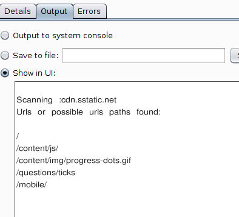

# Jsdir

Jsdir is an Burp Suite extension that extract hidden url paths from js files, beautify it and save for futher/better reading.

The extracted paths are printed on Burp Suite.

The beatified file is saved under db/beautified-files folder.

####  You can use with Burp Free version

# Requirements

- python 2.7.9 version
- js-beautifier python library
- BurpSuite Proxy
- Any ruby version installed

#### If it's a windows OS need to configure both ruby and python global variables

- To install python 2.7.9 check:
[https://www.python.org/downloads/release/python-279/](https://www.python.org/downloads/release/python-279/)
- To install ruby check:
[https://www.ruby-lang.org/pt/downloads/](https://www.ruby-lang.org/pt/downloads/)

## Linux Instalation:

Assuming that you already have python & pip installed

1. To install jsbeautifier:
  - Copy and paste in your terminal:
    ```
    sudo apt-get install jsbeautifier && pip install jsbeautifier
    ```
2.Ready to go !

## Windows Instalation

Assuming that you already installed python

1. Install jsbeautifier by copying and pasting this in your terminal:
    ```
    cd C:\Python27\Scripts\
    pip install jsbeautifier
    ```
2. Copy all files and folders of this repo and paste inside C:\Python27\Scripts folder


#### If it's a windows OS need to configure both ruby and python global variables

- Your path variable is probably already set if you used rubyinstaller. If not, please check this [discussion at stackoverflow.](https://stackoverflow.com/questions/26947427/how-do-i-add-ruby-to-the-path-variable-on-windows)

- For python check this [discussion](https://superuser.com/questions/143119/how-do-i-add-python-to-the-windows-path)

# Usage

Import this extension in Extender Tab of Burp Suite.

- If you are a linux user, please use bs_jsscrapper_linux file
- If you are a windows user, please use bs_jsscrapper file

Then when you see an Js file in any response of any server inside Burp Suite,

Just click on it with the right button and choose "Send to Js scrapper" option.

Go to extender tab and see the results. Example output:

  

# Notes

Please feel free to help me improve this tool. Thank you Jobert.

*Lopseg*
